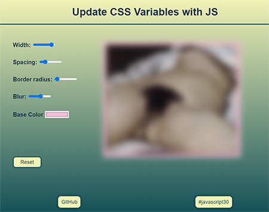

# [Wes Bos' 30 days Vanilla JS challenge](https://javascript30.com/).

## No frameworks, no compilers, no fuss.

### **[Day 03: CSS variables](https://2y2son4.github.io/css-variables-day03)**.

#### **CSS**

- :root
- variables
- grid

#### **JS**

- Node list
- forEach
- [HTMLElement.dataset](https://developer.mozilla.org/en-US/docs/Web/API/HTMLOrForeignElement/dataset)
- document.documentElement

